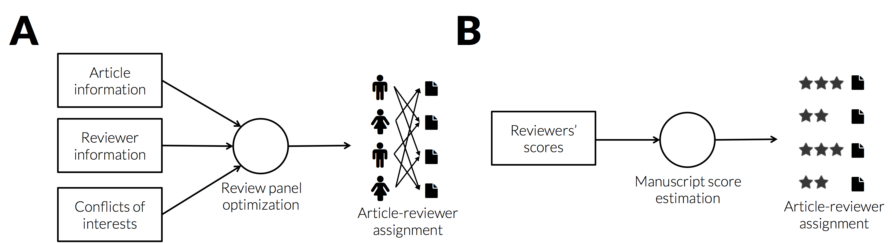
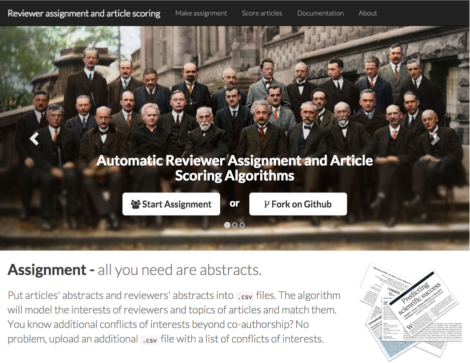

# Website for Automatic Reviewer Assignment and Manuscript Scoring

*Daniel Acuna1,2, Titipat Achakulvisut2, Konrad Kording1,2*

*1 Rehabilitation Institute of Chicago*  
*2 Northwestern University*  

**Keywords:** *Team Assembly, Methods for Science of Team Science Research,
Big Data*

The peer review process is an important component of the scientific process.
Its success depends on the
right formation of a team of peers that evaluates and scores manuscripts.
These steps crucially hinges on editors
who must thoughtfully look for appropriate peer scientists while juggling
their expertise and conflict of interests of mostly unknown reviewers, and deciding whether to accept the suggested reviewers provided by authors. Recently, however, it has been shown that
the peer review process is highly subjective [1], creating panels that rarely agree among themselves [2],
and are biased towards their own domains [3]. Additionally, after the reviews are in, the editors
must weigh the scores provided by reviewers accounting for potential excessive harshness
or carelessness of a reviewer.
It is thus important to address these shortcomings to make the process faster and
less biased..

<table class="image">
<tr><td>

</td></tr>
<caption align="top">
**Figure 1** Reviewer assignment process. **A.** Article information, reviewer information,
and (optinally) conflict of interests beyond co-authorship are combined to
produce assignments that minimize total article-reviewer topic distance. **B.**
Reviewer scores are used by a Bayesian random effects model that controls for
systematically biased reviewers.
</caption>
</table>

In this work, we will present a website that implements our current research on
automated article-reviewer assignment and manuscript scoring. Importantly, our
article-reviewer assignment algorithm provides an good initial solution without
using the authors suggested reviewers or reviewers bidding on articles.
The algorithm does the
matching by finding a global assignment that maximizes the topic similarity
between articles and reviewers (Fig 1a). The procedure readily manages conflict of interests
due to co-authorship and additional conflict of interests provided by the editors.
The assignment is based on an extremely fast topic modeling approach and optimization
based on linear programming. Therefore, if needed, the editors can iterate over many
automated suggestions made by the system almost in real time. The website, therefore, gives an
fast solution to the article-reviewer assignment, which allows editors
to focus on the refinement of such assignment and higher level decisions.

<table class="image">
<tr><td>

</td>
</tr>
<caption align="bottom">
**Figure 2** Article-reviewer assignment and manuscript scoring website. Freely
available at <code>http://pr.scienceofscience.org</code>
</caption>
</table>

The second algorithm implemented by our website solves the manuscript scoring
estimation. The estimation is based on a Bayesian random effects model that
automatically control some problems with the naive average scoring per article (Fig. 1b).
First, if a reviewer
systematically gives higher scores than their peers, then the reviewer's scores
will have less weigh during the estimation. The converse case is similar.
Second, the scoring system provides uncertainty estimates about each score,
potentially signaling which articles are harder to assess.
This can be taken into account by editors who would consider external criteria
to rank articles and produce accept-reject decisions. This website scoring
therefore solves an important problem of the review process and can be used by
any discipline.

This presentation will describe algorithms and a website that complement the
tools available during the peer reviewer process (Fig. 2). The suggestions provided by
reviewer-article assignment are for now useful first solution to the hard problem posed by team science formation.

## References
  1. Smith, R. (2006). *Peer review: a flawed process at the heart of science and journals*. Journal of the royal society of medicine, 99(4), 178-182.
  2. Price, Eric (2014). *The NIPS experiment* <code>http://blog.mrtz.org/2014/12/15/the-nips-experiment.html</code> (Visited: 02/26/2015)
  3. van Wilgenburg, E., & Elgar, M. A. (2013). *Confirmation bias in studies of nestmate recognition: a cautionary note for research into the behaviour of animals*. PloS one, 8(1), e53548.
